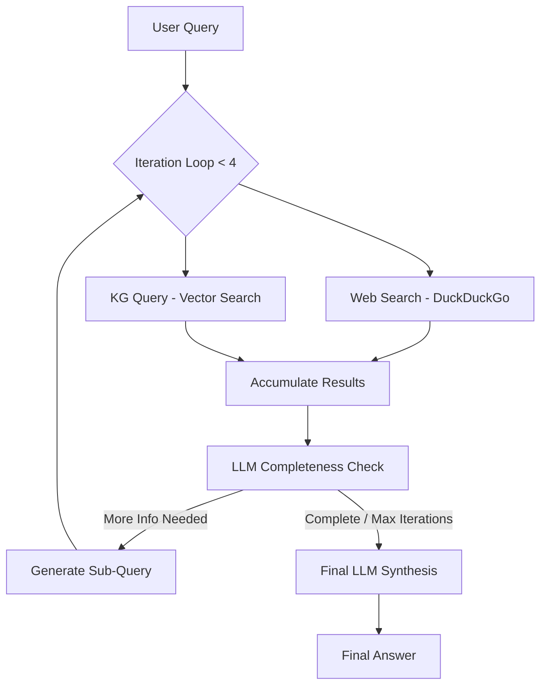

# Iterative Search Agent Architecture

This document describes the design and implementation of the Iterative Search Agent, which combines Web search and Knowledge Graph (KG) queries to provide comprehensive answers.

## Overview

The agent follows an iterative research pattern, gathering information across multiple steps to ensure all aspects of a user query are addressed. It integrates traditional web scraping with structured data from a Neo4j-backed Knowledge Graph.

## Workflow

## Key Components

### 1. Web Search (`search_web`)
- Uses `DDGS` (DuckDuckGo Search) to find relevant URLs.
- Scrapes the full text content of those URLs using `BeautifulSoup`.
- Provides raw text context for the LLM.

### 2. Knowledge Graph Integration (`query_knowledge_graph`)
- Calls a FastAPI endpoint (`/query-kg`) that interacts with a Neo4j database.
- Uses vector similarity search to find entities and their relationships.
- Enhances the context with structured "facts" already present in the system.

### 3. Iterative Control Loop (`run_websearch_agent`)
- Limits research to **4 iterations** to balance depth and performance.
- Maintains `all_iterations` context to avoid redundant searches and provide full history to the synthesis step.

### 4. Completeness Check (`check_search_completeness`)
- A specialized LLM call that analyzes the gathered information against the original question.
- **Output**: A JSON object indicating if the task is done or providing a `next_query`.
- This makes the agent "curious" and able to dig deeper into missing details.

### 5. Final Synthesis (`synthesize_answer_with_llm`)
- Takes the entire research history (all iterations).
- Structures the answer with citations and clear explanations.
- Differentiates between Web findings and Knowledge Graph extractions.

## Technology Stack
- **LLM**: Groq (Model: `openai/gpt-oss-120b`)
- **Search**: DuckDuckGo (no API key required)
- **Knowledge Graph**: FastAPI, Neo4j, Vector Index
- **Logic**: Python, Requests, BeautifulSoup
